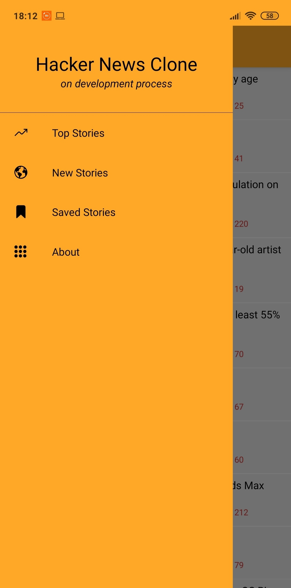

# HackerNews Clone

HackerNews mobile app clone made by React Native 0.63.2
# About Project
This is my first React Native app, this project helps me to understand fundamentals of RN and improve my skills in software development journey. 

# Libraries and Tools 
* [React Hooks](https://reactjs.org/docs/hooks-intro.html)
* [React Navigation](https://reactnavigation.org/)
* [HackerNews API](https://github.com/HackerNews/API)
* [React Native HTMLView](https://github.com/jsdf/react-native-htmlview)
* [React Native Progress WebView](https://github.com/wangdicoder/react-native-progress-webview)
* [React Native Share](https://github.com/react-native-share/react-native-share)
* [AsyncStorage](https://github.com/react-native-async-storage/async-storage)
* [Vector Icons](https://github.com/oblador/react-native-vector-icons)
* [Axios](https://github.com/axios/axios)

# Screenshots

  
   
  
   
  
  

                                 
                                                
